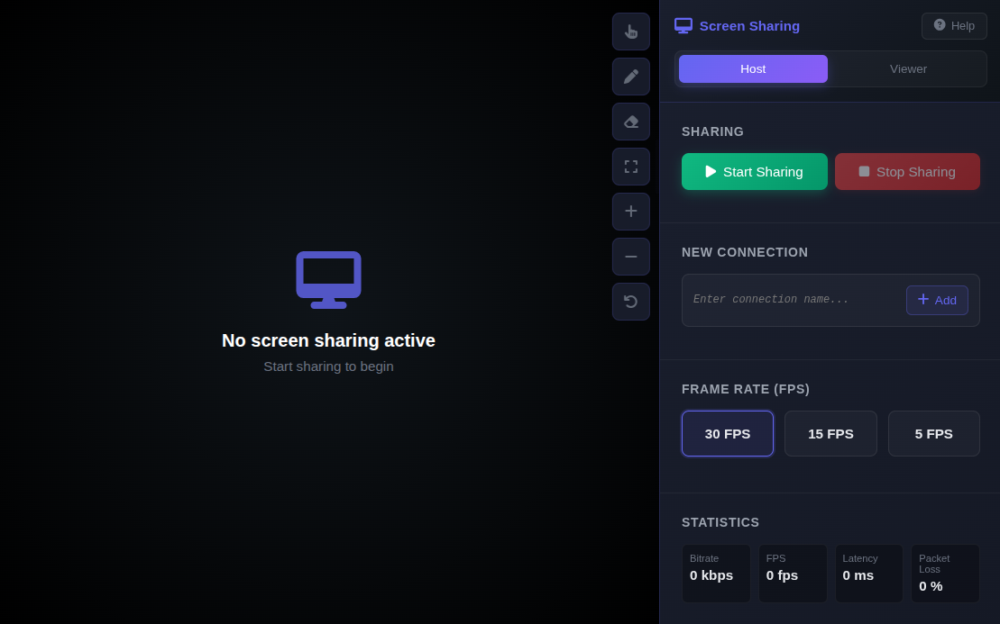

# Screen Sharing Application

A modern, feature-rich web-based screen sharing application built with HTML, CSS, and JavaScript. This application allows users to share their screen with others in real-time, including interactive drawing tools and connection management.

## Features

- **Real-time Screen Sharing**: Share your screen with one or multiple viewers using WebRTC.
- **Interactive Drawing Tools**:
  - Pointer mode for highlighting content.
  - Drawing mode with real-time sync across all connected viewers.
  - Clear drawings functionality.
- **Multi-Connection Support**: Host can manage multiple viewer connections simultaneously.
- **Dynamic UI**:
  - Toggle UI visibility with keyboard shortcut (`H`).
  - Auto-hiding toolbar for immersive viewing.
  - Responsive design for various screen sizes.
- **Video Controls**:
  - Zoom in/out and reset zoom functionality.
  - Pan around the zoomed video.
  - Fullscreen mode.
- **Connection Management**:
  - Create and manage multiple named connections.
  - Copy and paste connection codes for easy sharing.
  - Visual status indicators for each connection.
- **Performance Monitoring**:
  - Real-time statistics for bitrate, FPS, latency, and packet loss.
  - Visual indicators (good/warning/bad) for performance metrics.
- **Frame Rate Control**: Adjust the frame rate (5, 15, 30 FPS) for optimized performance.
- **Keyboard Shortcuts**: Convenient shortcuts for common actions.
- **Dark Theme**: Aesthetically pleasing dark UI for comfortable viewing.

## Screenshot



*Example of the application's user interface showing the video feed, toolbar, and side panel.*

## Technologies Used

- HTML5
- CSS3 (including Flexbox and Grid)
- JavaScript (ES6+)
- WebRTC (RTCPeerConnection, MediaDevices, DataChannel)
- Font Awesome (for icons)

## How to Use

### As a Host

1.  Open the application in a browser (preferably Chrome, Firefox, or Edge).
2.  Select the "Host" mode using the toggle button.
3.  Click "Start Sharing".
4.  Choose the screen or application window you wish to share.
5.  Add new connections by providing a name and clicking "Add".
6.  Share the generated connection code with viewers.
7.  Use the toolbar to activate pointer or drawing tools.
8.  Adjust frame rate using the controls in the sidebar.
9.  Monitor connection statistics in real-time.

### As a Viewer

1.  Open the application in a browser.
2.  Select the "Viewer" mode using the toggle button.
3.  Paste the connection code provided by the host into the input field.
4.  Click the "Paste" button.
5.  You will receive an answer code; copy this and send it back to the host.
6.  Once the host accepts your connection, the shared screen will appear.
7.  You can also use drawing tools (your drawings will be in a different color).

## Keyboard Shortcuts

| Action               | Key         |
| -------------------- | ----------- |
| Hide/Show UI         | `H`         |
| Fullscreen/Exit      | `F11`       |
| Exit Fullscreen      | `ESC`       |
| Zoom In              | `+`         |
| Zoom Out             | `-`         |
| Reset Zoom           | `0`         |
| Activate Pointer     | `P`         |
| Activate Drawing     | `R`         |
| Clear Drawing        | `C`         |

## Installation

This application runs entirely in the browser and does not require any server-side installation or build process. Simply open the `index.html` file in a compatible web browser.

```bash
# Clone or download the repository
git clone <repository-url>
# Navigate to the project directory
cd <project-directory>
# Open the HTML file in your browser
open index.html
